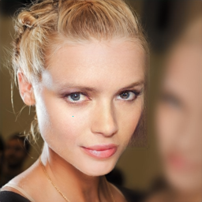
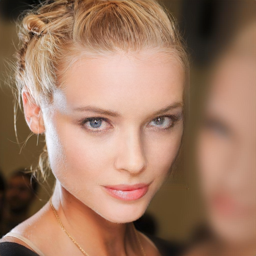
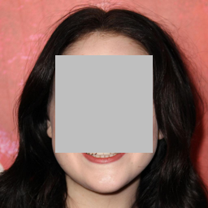
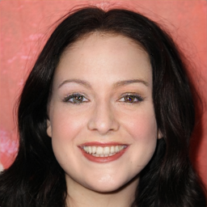
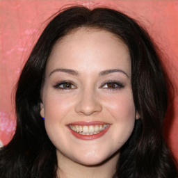

# Generative Image Inpainting Based on Wavelet Transform Attention Model

[ISCAS 2020 Paper](https://doi.org/10.1109/ISCAS45731.2020.9180927) | 
[Poster](https://github.com/ChenWang8750/WTAM/blob/master/imgs/ISCAS_Poster.pdf) |
[BibTex](#citing)

**Update (Jun, 2021)**:
1. The tech report of our new image inpainting system MuFA-Net is released, please checkout branch [v2.0.0](https://github.com/ChenWang8750/MuFA-Net) 
2. WTAM is trained and mainly works on rectangular masks, while MuFA-Net can generate high quality inpainting results for variable masks.

# Example inpainting results
<table style="float:center">
<tr>
  <td>
   
  </td>
  <td>
  
  </td>
  <td>
  
  </td>
  <td>
   
  </td>
 </tr>
 
 <tr>
     <td>
   
  </td>
  <td>
  
  </td>
  <td>
  
  </td>
  <td>
   
  </td>
 </tr>
 <tr>
  <th><b>Input</b></th> <th><b> Ours(U-net) </b></th> <th><b> Ours(UNet++)</b> <th><b>Ground-truth</b></th>
 </tr>
  </table> 


## Network Architecture
<table>
  <tr>
    <td>  </td>
    <td>  </td>
  </tr>
  <tr>
    <td><p align="center"><b>Overall Framework</b></p></td>
    <td><p align="center"><b>Wavelet Transform Attention Model (WTAM)</b></p></td>
  </tr>
</table>


## Run

0. Requirements:
    * Install python3.
    * Install PyTorch (tested on Release>=0.4.0).
    * Install python libraries [visdom](https://github.com/facebookresearch/visdom) and [dominate](https://github.com/Knio/dominate).
1. Training:
    * Prepare training image datasets.
    * Modify [base_options.py](https://github.com/ChenWang8750/WTAM/blob/master/options/base_options.py) to set parameters.
    * Run `python train.py`.
2. Testing:
    * Prepare testing image datasets.
    * Modify [test_options.py](https://github.com/ChenWang8750/WTAM/blob/master/options/test_options.py) to set parameters.
    * Run `python test.py`.


## Pretrained models

[Paris StreetView] | [CelebA-HQ]

Rename `face_center_mask.pth` to `30_net_G.pth`, and put it in the folder `./log/face_center_mask`(if not existed, create it)

```bash
# CelebA-HQ 256x256 input
python test.py --which_model_netG='WTAM' --model='WTAM' --name='face_center_mask' --which_epoch=30 --dataroot='./datasets/test' `.
```

**Note:** For models trained with extra irregular masks, make sure ` --offline_loading_mask=1  --testing_mask_folder='masks' `.

## Visdom

To view training results and loss plots, run `python -m visdom.server` and click the URL http://localhost:8097. The checkpoints will be saved in `./log` by default.


## Citing
If you use this code, please consider citing:
```
@inproceedings{wang2020generative,
  title={Generative Image Inpainting Based on Wavelet Transform Attention Model},
  author={Wang, Chen and Wang, Jin and Zhu, Qing and Yin, Baocai},
  booktitle={ISCAS},
  pages={1--5},
  year={2020},
  organization={IEEE}
}

```

## Contacts

Please contact _chenwang8750@gmails.com_  or open an issue for any questions or suggestions.

Thanks! (●'◡'●)

## Acknowledgments
Thanks the author of  [Shift-Net_pytorch](https://github.com/Zhaoyi-Yan/Shift-Net_pytorch) for their excellent work. 
